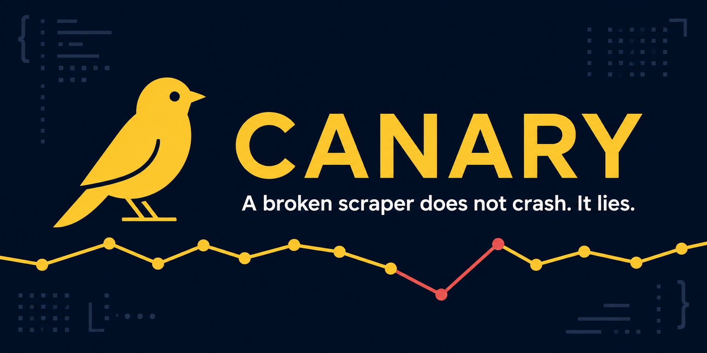

<p align="center">
  
</p>

**A broken scraper does not crash. It lies.** It still returns 200, the dashboard still loads, and
nobody notices a field stopped extracting — until someone searches recalls by article number, gets
zero results, and a tip-over-prone dresser stays in a child's room.

Canary is a supervision layer for a Bright Data **Scraper Studio** collector on **IKEA US product
recall notices**. It stores every run as an immutable snapshot, compares each run to the last
**verified** one, and when a field silently drops it quarantines the bad snapshot, writes a precise
heal prompt, previews and validates the repair, waits for human approval, and recovers **the same
`c_*` Collector ID** — with before/after numbers.

## Run it (60 seconds, offline)

```bash
pip install -e ".[dev]"
canary init-db
canary ingest fixtures/ikea_baseline.json      # run #1 → verified baseline (OK, 6 rows)
canary ingest fixtures/ikea_broken_hazard.json # hazard silently drops → CRITICAL signal + heal prompt
canary history                 # run ledger: #1 OK (verified) vs #2 PARTIAL (quarantined)
pytest                         # health-engine signals, no network
```

## The loop

`silent-failure evidence → precise heal prompt → Scraper Studio preview → validate →
approve / reject → same Collector ID → verified recovery`

The five signals (null-rate, cardinality, row-count, schema-drift, format) are the sensors.
The closed loop is the product.

## Scraper Studio

- Collector: `SCRAPER_STUDIO_COLLECTOR_ID=c_mt07a4h921tnzr8kvt` (`canary-ikea-recalls`)
- Type: batched PDP collector over a fixed IKEA recall-notice cohort (`fixtures/ikea_recall_urls.json`)
- Heal event: _(before/after, e.g. `hazard 6/6 → 0/6 → 6/6`, same `c_*`)_

## AI disclosure (rule 10)

Built with AI assistance (Claude Code); every file is human-reviewed and explainable.
